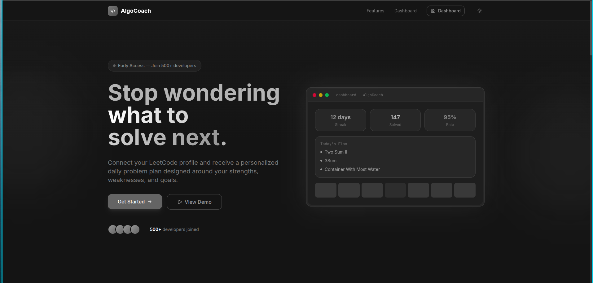
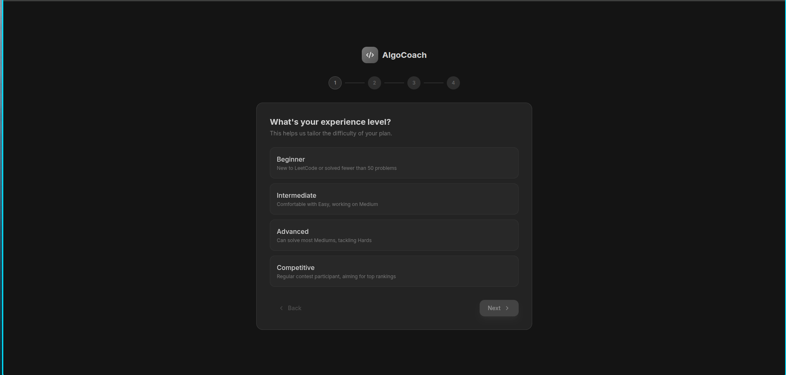
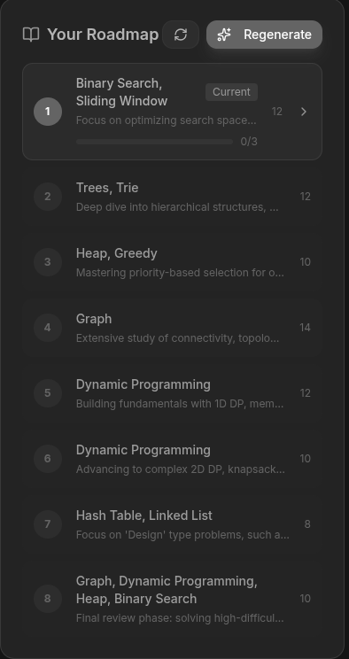
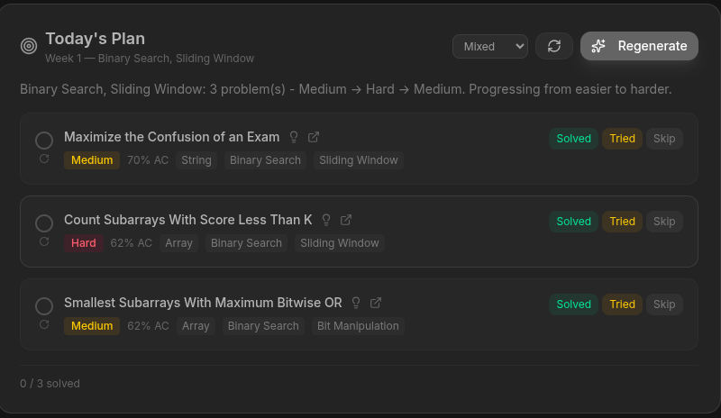

# AlgoCoach 🎯

<p align="center">
  
  
  
  
</p>

<p align="center">
  <b>AI-powered LeetCode study planner</b><br>
  Personalized roadmaps, daily problem sets, progress tracking — all local, all private.
</p>

<br>

<p align="center">
  <kbd>
    
  </kbd>
</p>

<p align="center">
  <em>Dashboard showing today's plan, roadmap progress, and LeetCode stats</em>
</p>

---

## ✨ Features

| | Feature | Description |
|---|---|---|
| 🗺️ | **AI Roadmap** | Personalized multi-week study plan based on your skill level and goals |
| 📅 | **Daily Plans** | 3 curated problems (Easy + Medium + Hard) every day — never wonder what to solve |
| 🔄 | **Auto-refresh** | Stuck on a problem? Replace it with an easier one or regenerate the whole set |
| 📊 | **Progress Tracking** | Solved/tried/skipped counts, streaks, and topic-level progress |
| 🔗 | **LeetCode Sync** | Link your LeetCode account to auto-fetch your stats |
| 🔒 | **100% Local** | Database stored at `~/.algocoach/data.db`. No cloud, no signup, no data leaks |
| 🚀 | **AI Anywhere** | Works with Google Gemini, Groq, or NVIDIA NIM |

---

## 🚀 Quick Start

```bash
# Install (requires Bun)
npm install -g algocoach

# Start — creates config, opens browser
algocoach start
```

<p align="center">
  
</p>

---

## 🖥️ Screenshots

<p align="center">
  <table>
    <tr>
      <td align="center">
        <br>
        <em>Skill survey</em>
      </td>
      <td align="center">
        <br>
        <em>AI-generated roadmap</em>
      </td>
    </tr>
    <tr>
      <td align="center">
        <br>
        <em>Today's problems</em>
      </td>
      <td align="center">
        <br>
        <em>Progress & streaks</em>
      </td>
    </tr>
  </table>
</p>

---

## 📖 Usage

### First Time

```bash
algocoach start
```

This creates `~/.algocoach/.env`. Edit it to set your AI provider API key:

```env
AI_PROVIDER=google
GEMINI_API_KEY=AIza...
```

Then run `algocoach start` again.

### Commands

```bash
algocoach start    # Create config if needed + start server + open browser
algocoach init     # Only create config file
```

### Daily Workflow

```
1. Open http://localhost:3000
2. Complete the onboarding survey
3. Link your LeetCode username
4. Generate a roadmap (AI creates a study plan)
5. Open "Today's Plan" → solve 3 curated problems
6. Track progress daily
```

### Regenerating Problems

- **Per problem**: Click the ↻ icon next to any problem to replace it
- **All problems**: Click "Regenerate" to get 3 entirely new problems
- **Stuck?**: Click "I'm stuck" on a tried problem to get an easier one

---

## ⚙️ Configuration

| Variable | Default | Description |
|---|---|---|
| `AI_PROVIDER` | `google` | `google`, `groq`, or `nvidia` |
| `GEMINI_API_KEY` | — | Google Gemini API key |
| `GROQ_API_KEY` | — | Groq API key |
| `NVIDIA_API_KEY` | — | NVIDIA NIM API key |
| `AI_MODEL` | (provider default) | Override the AI model |
| `PORT` | `3000` | Server port (auto-fallsback if busy) |

Config file: `~/.algocoach/.env`

### Get an API Key

| Provider | Get Key | Free Tier |
|---|---|---|
| **Google Gemini** | [aistudio.google.com](https://aistudio.google.com) | ✅ Yes |
| **Groq** | [console.groq.com](https://console.groq.com) | ✅ Yes (fast!) |
| **NVIDIA NIM** | [build.nvidia.com](https://build.nvidia.com) | ✅ Yes |

---

## 🏗️ Architecture

```
┌─────────────────────────────────────────────┐
│               algocoach CLI                  │
│  start / init / serve                        │
└──────────────────┬──────────────────────────┘
                   │
┌──────────────────▼──────────────────────────┐
│            Hono HTTP Server                  │
│  API routes  +  Static frontend (dist/)      │
└───────┬─────────────────────┬───────────────┘
        │                     │
┌───────▼───────┐   ┌────────▼────────┐
│  SQLite DB     │   │  AI Providers   │
│  ~/.algocoach/ │   │  Google / Groq  │
│  data.db       │   │  / NVIDIA       │
└───────────────┘   └─────────────────┘
```

**Stack**: Bun + Hono + React + Tailwind + Drizzle ORM + SQLite + Better Auth

### Data

- **Database**: `~/.algocoach/data.db` — persists across restarts, never sent anywhere
- **Config**: `~/.algocoach/.env` — API keys stay on your machine
- **No telemetry, no cloud, no signup**

---

## 🧪 Development

```bash
git clone https://github.com/NitheshChakaravarthySeelan/algo-coach
cd algo-coach
bun install
bun run dev       # Dev mode (hot reload)
bun run build     # Production build
bun test          # Run tests
```

---

## 📄 License

GNU Affero General Public License v3 (AGPL-3.0)

You're free to fork, modify, and use it personally. If you distribute or run a modified version as a service, you **must** release your source code as well. This prevents anyone from making a proprietary closed-source version of AlgoCoach.

---

<p align="center">
  Made by <a href="https://github.com/NitheshChakaravarthySeelan">NitheshChakaravarthySeelan</a><br>
  <sub>Built with Bun, React, and a lot of AI tokens</sub>
</p>
